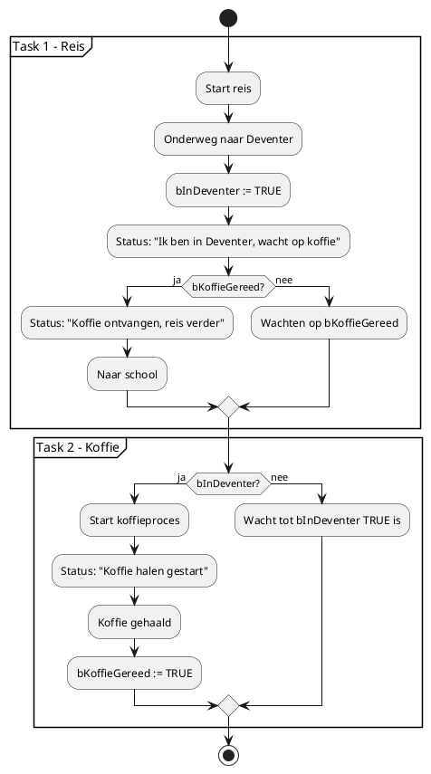

# Chapter 1

```plantuml
@startuml
start

partition "Task 1 - Reis" {
    :Start reis;
    :Onderweg naar Deventer;
    :bInDeventer := TRUE;
    :Status: "Ik ben in Deventer, wacht op koffie";

    if (bKoffieGereed?) then (ja)
        :Status: "Koffie ontvangen, reis verder";
        :Naar school;
    else (nee)
        :Wachten op bKoffieGereed;
    endif
}

partition "Task 2 - Koffie" {
    if (bInDeventer?) then (ja)
        :Start koffieproces;
        :Status: "Koffie halen gestart";
        :Koffie gehaald;
        :bKoffieGereed := TRUE;
    else (nee)
        :Wacht tot bInDeventer TRUE is;
    endif
}

stop
@enduml
```
